# 🐔 HatchCoopClicker - iOS Chicken Farm Game

**HatchCoopClicker** - это увлекательная iOS игра в жанре idle/clicker с тематикой куриной фермы. Игроки управляют своей фермой, выращивают цыплят, решают головоломки и зарабатывают монеты. Игра сочетает в себе образовательный контент, развлекательные мини-игры и систему прогрессии.

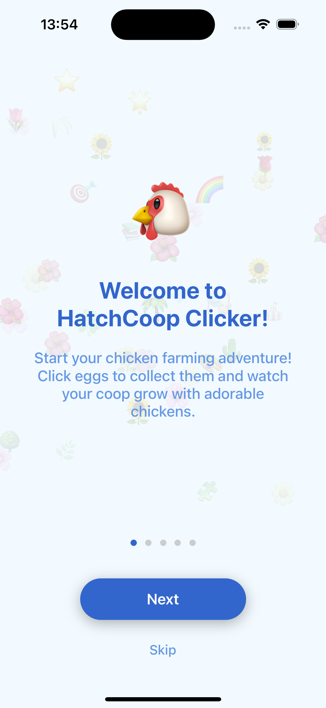

## 🎯 О проекте

HatchCoopClicker - это не просто игра, а образовательная платформа, которая знакомит игроков с удивительным миром кур через интерактивный геймплей. Проект разработан с использованием современных iOS технологий и следует принципам геймификации для максимального вовлечения пользователей.

## 📱 Основные возможности

### 🏠 Coop (Главный экран)
- **Система уровней**: Прогресс игрока отображается через уровни и XP
- **RanchCoins**: Внутриигровая валюта для покупок
- **Мини-игры**: Доступ к различным головоломкам и играм
- **Викторины**: Образовательные тесты с наградами

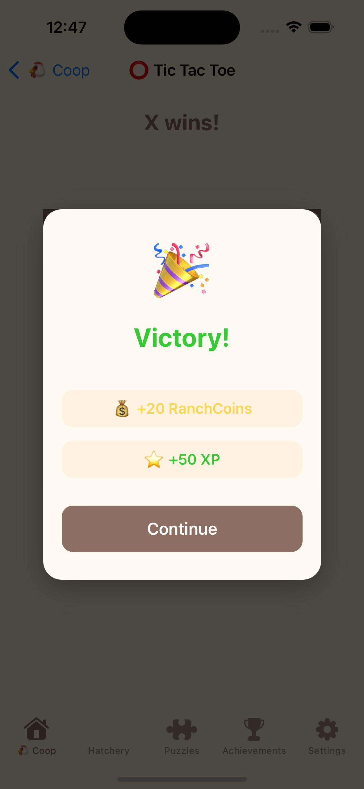

**Детали интерфейса:**
- Карточка прогресса с текущим уровнем и XP
- Кнопка "Take Quiz" для доступа к викторинам
- Сетка мини-игр с описаниями
- Интуитивная навигация

### 🐣 Hatchery (Инкубаторий)
- **Факты о цыплятах**: Образовательный контент с интересными фактами
- **10 уникальных категорий**:
  - 🥚 Яйценоскость - до 300 яиц в год
  - 👁️ Цветовое зрение - лучше человеческого
  - 🧠 Память и интеллект - распознают 100+ лиц
  - 👑 Социальная иерархия - строгий порядок
  - 💤 Сновидения цыплят - REM-сон
  - 🗣️ Коммуникация - 30+ звуков
  - 🌡️ Терморегуляция - не потеют
  - 🐣 Развитие яиц - 21 день инкубации
  - 🌈 Цвета перьев - все цвета радуги
  - ⏰ Продолжительность жизни - 5-10 лет

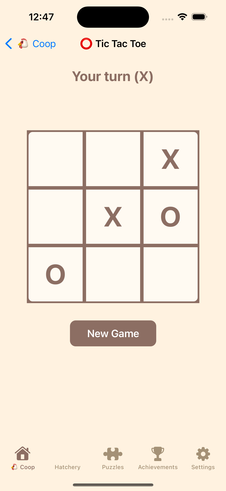

### 🗺️ Chicken Map (Карта цыплят)
- **Интерактивная карта**: Основана на MapKit с центром в Нью-Йорке
- **Покупка цыплят**: Появление цыплят на карте каждые 5 секунд
- **Пассивный доход**: Каждый купленный цыпленок приносит доход
- **Статистика**: Отслеживание количества цыплят и дохода

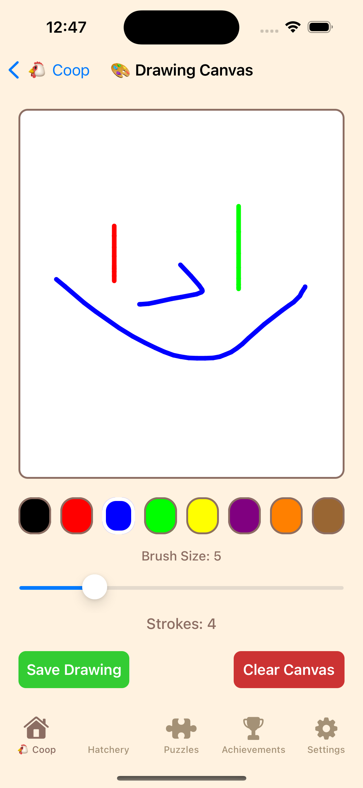

**Особенности карты:**
- Реальные координаты Нью-Йорка
- Интерактивные точки покупки цыплят
- Система пассивного дохода
- Визуальная статистика

### 🏅 Achievements (Достижения)
- **15 уникальных достижений** в различных категориях:
  - 🐣 Первый выводок - первый цыпленок
  - 🐔 Фермер цыплят (10 цыплят) - начало фермы
  - 🏠 Ранчер цыплят (50 цыплят) - крупная ферма
  - 🧩 Профессионал головоломок (5 игр) - любитель игр
  - 🏆 Мастер головоломок (20 игр) - эксперт
  - 🪙 Коллекционер монет (500 монет) - накопитель
  - 💎 Миллионер монет (2000 монет) - богач
  - 📚 Ученый викторин (3 викторины) - эрудит
  - 🎓 Мастер викторин (10 викторин) - профессор
  - ⭐ Повышение уровня (5 уровень) - рост
  - 👑 Король курятника (15 уровень) - владыка
  - 📝 Строитель слов (5 игр Word Builder) - лингвист
  - ⭕ Профессионал крестиков-ноликов (5 игр) - стратег
  - 💣 Сапер (5 игр Minesweeper) - логик
  - 🗺️ Исследователь карты (10 цыплят с карты) - путешественник

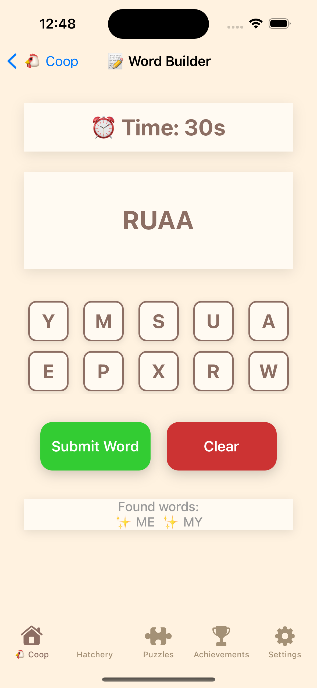

### ⚙️ Settings (Настройки)
- **Режимы игры**: Casual, Timed, Silent
- **Статистика**: Подробная информация о прогрессе
- **Сброс данных**: Возможность начать заново
- **Правовая информация**: Privacy Policy и Terms of Service

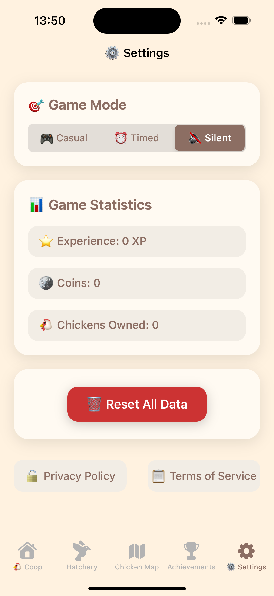

## 🎮 Мини-игры

### 📝 Word Builder
- **Цель**: Составлять слова из предложенных букв
- **Время**: 60 секунд
- **Механика**: Нажатие на буквы для составления слов
- **Награды**: Монеты и XP за найденные слова

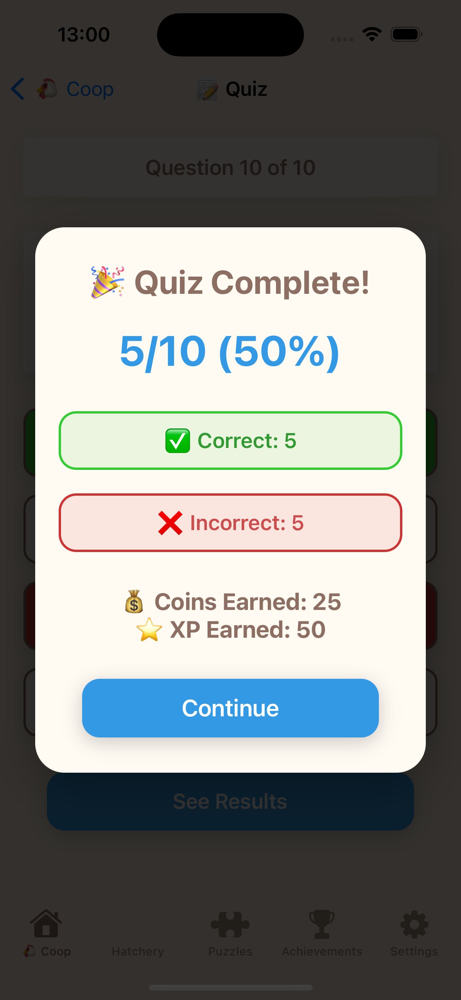

**Особенности игры:**
- Обширный словарь английских слов
- Система подсчета очков
- Визуальная обратная связь
- Прогресс в достижениях

### ⭕ Tic Tac Toe
- **Классическая игра** в крестики-нолики
- **ИИ противника** для одиночной игры
- **Награды** за победы

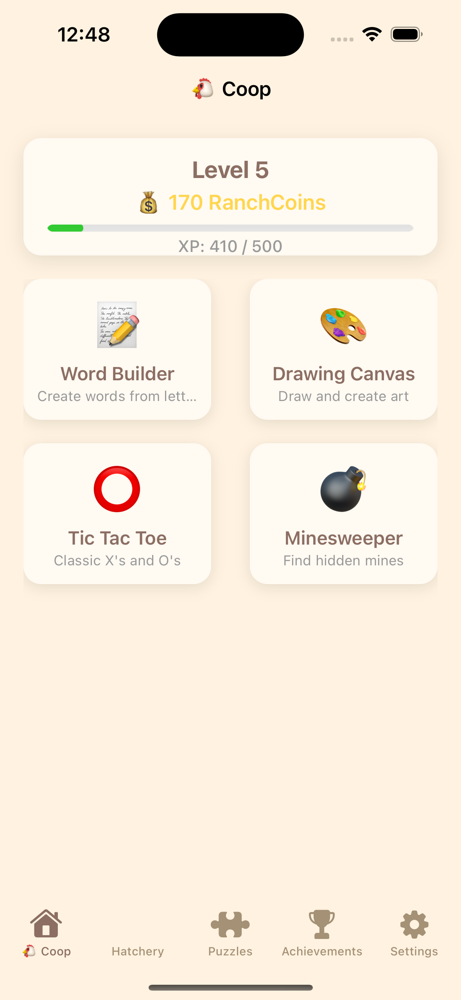

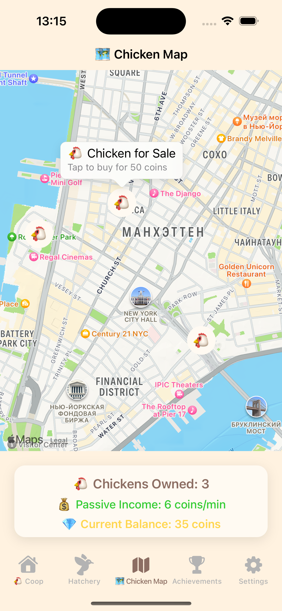

### 💣 Minesweeper
- **Логическая головоломка** с минами
- **Различные уровни сложности**
- **Награды** за успешное прохождение

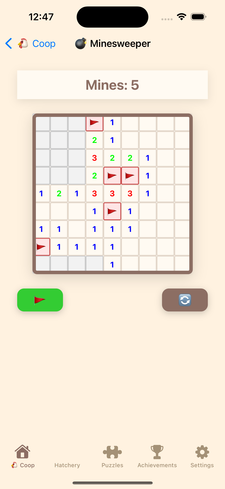

### 🎨 Drawing Game
- **Творческая игра** для рисования
- **Различные инструменты** и цвета
- **Награды** за участие

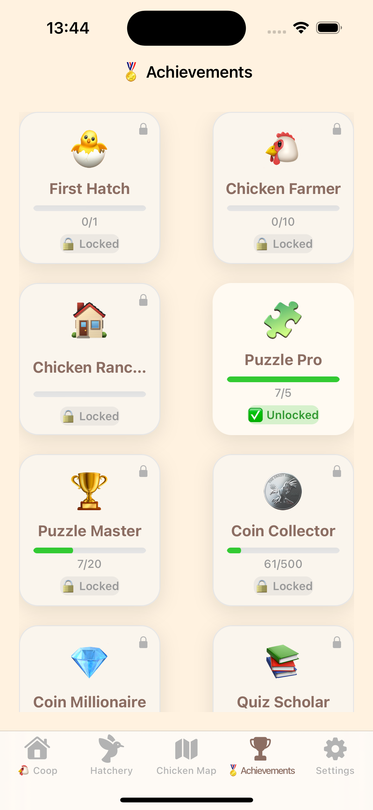

## 🧠 Викторины

### Образовательный контент
- **20 вопросов** по различным темам:
  - География (столицы, страны, океаны)
  - Наука (планеты, химия, физика)
  - История (войны, изобретения)
  - Математика (числа, геометрия)
  - Биология (животные, анатомия)

### Система наград
- **Монеты** за правильные ответы
- **XP** за завершение викторины
- **Прогресс** в достижениях

### Ключевые технологии
- **UIKit**: Основной фреймворк для UI
- **MapKit**: Интерактивная карта
- **UserDefaults**: Сохранение прогресса
- **Core Data**: Локальное хранение данных
- **Auto Layout**: Адаптивный дизайн

### Архитектурные паттерны
- **MVVM**: Model-View-ViewModel для разделения логики
- **Singleton**: Для глобального доступа к данным игры
- **Delegate Pattern**: Для коммуникации между компонентами
- **Observer Pattern**: Для обновления UI при изменении данных

## 🎨 Дизайн и UX

### Цветовая схема
- **Основной фон**: Светло-бежевый (#FFF0E1)
- **Карточки**: Белый с тенью (#FFF8F2)
- **Акценты**: Коричневый (#8C6E63)
- **Монеты**: Золотой (#FFD64F)
- **XP**: Зеленый (#33CC33)

### UI/UX особенности
- **Современный дизайн** с закругленными углами
- **Тени и градиенты** для глубины
- **Эмодзи** для визуального привлечения
- **Адаптивный интерфейс** для разных размеров экранов
- **Плавные анимации** и переходы

## 📊 Система прогрессии

### Уровни и XP
- **Формула уровней**: Уровень = XP / 100 + 1
- **Источники XP**:
  - Мини-игры: 10-50 XP
  - Викторины: 20-100 XP
  - Покупка цыплят: 5 XP
  - Достижения: 50-200 XP

### Экономика
- **RanchCoins**: Основная валюта
- **Источники дохода**:
  - Мини-игры: 5-25 монет
  - Викторины: 10-50 монет
  - Пассивный доход от цыплят
  - Достижения: 100-500 монет

### Пассивный доход
- **Каждый цыпленок**: +1 монета каждые 30 секунд
- **Максимальный доход**: Неограничен
- **Автоматическое начисление** в фоне

## 📈 Статистика проекта

### Количество файлов
- **Swift файлов**: 25+
- **UI компонентов**: 15+
- **Мини-игр**: 4
- **Достижений**: 15
- **Вопросов викторины**: 20

### Технические характеристики
- **Размер проекта**: ~2MB
- **Целевая платформа**: iOS
- **Минимальная версия**: iOS 13.0
- **Язык разработки**: Swift 5.0

## 🤝 Вклад в проект

Мы приветствуем вклад в развитие проекта! Если у вас есть идеи для улучшения:

1. Создайте Issue с описанием предложения
2. Форкните репозиторий
3. Создайте ветку для новой функции
4. Внесите изменения
5. Создайте Pull Request
